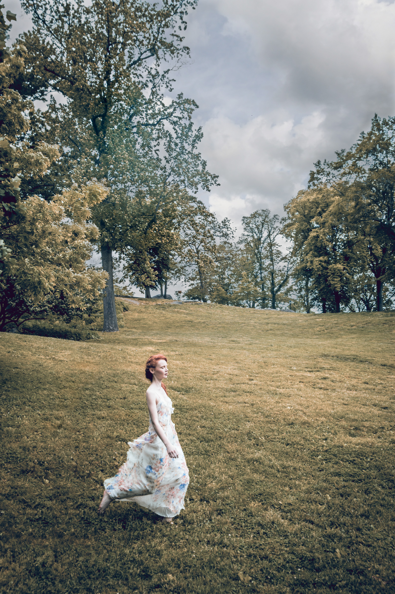

# High-End Fashion Photography in NYC

  <strong>Editorial fashion photography, luxury visual storytelling, studio lighting, and campaign production by Ken Jones Photography.</strong>

---

## Creating Fashion Images That Feel Luxury

Luxury fashion photography is not simply about photographing expensive clothing. A designer dress, custom tailoring, or premium fabric can still look flat if the lighting, styling, and visual direction are not working together. Strong fashion imagery should create mood, atmosphere, and a sense of story around the clothing.

As a New York City fashion photographer, I approach fashion photography as a collaboration between the photographer, designer, stylist, model, makeup artist, and creative team. The goal is not only to show the garment, but to create a visual world around it that gives the clothing context and emotion.

Many of the editorial projects featured throughout [Ken Jones Photography](https://kenjonesnyc.com) were built around this idea — combining lighting, movement, styling, and location to create imagery that feels cinematic and intentional rather than simply commercial.

---

## Fashion Photography Beyond E-Commerce

There is a major difference between standard e-commerce photography and editorial fashion photography.

E-commerce photography is designed to clearly display products for online shopping. Editorial fashion photography is designed to create feeling, identity, and visual storytelling around the clothing.

This does not mean one is better than the other. Both serve different purposes.

For luxury brands, magazines, and designer campaigns, editorial imagery helps establish brand identity and emotional connection. A strong fashion editorial can help a collection feel aspirational while also giving the audience a stronger sense of the designer’s creative direction.

Projects like [Angel Bounding](https://kenjonesnyc.com/angel-bounding) and [Future Boys](https://kenjonesnyc.com/future-boys) were created around this type of visual storytelling approach, combining studio photography with composited environments and cinematic lighting to build a complete visual atmosphere.

---

## The Role of Lighting in Fashion Photography

Lighting is often what separates a standard fashion image from a more refined editorial photograph.

Different fabrics and styling concepts require different lighting approaches:

- Soft directional lighting can enhance silk, lace, and beauty imagery
- Harder lighting can emphasize texture and structure
- Projection lighting and reflective materials can create mood and dimensionality
- Controlled shadows help shape the body and define garments

Throughout many of my editorials, lighting itself becomes part of the story.

For example:

- [Shadows and Sand](https://kenjonesnyc.com/shadows-and-sand) explored texture using black sand, oil, and projection lighting.
- [Not Knitted by Grams](https://kenjonesnyc.com/not-knitted-by-grams) used parabolic lighting, gels, and reflective materials to shape sculptural knitwear.
- [Color Contrast Zara](https://kenjonesnyc.com/color-contrast-zara) used Profoto projector lighting and expressive movement to create graphic studio imagery.

In beauty photography, subtle control of highlights and shadows becomes even more important. Projects like [Beauty by Bora](https://kenjonesnyc.com/beauty-by-bora) used a simple one-light setup combined with reflectors and black panels to shape light naturally across the face.

---

## Fashion Editorials as Collaboration

Fashion photography is highly collaborative by nature.

Many of the projects on my site were created alongside stylists, designers, modeling agencies, hair stylists, and makeup artists. Some began as magazine submissions, while others were creative test shoots designed to develop ideas and experiment visually.

Collaborations with agencies like Major Models NYC, stylists such as Renesta Olds, and designers including Zoe Champion Knitwear allowed projects to evolve into editorials that explored movement, texture, and unconventional styling concepts.

Shoots like [Silver and Blue](https://kenjonesnyc.com/silverandblue), [Noirion](https://kenjonesnyc.com/noirion), and [Maid to Photograph](https://kenjonesnyc.com/maid-to-photograph) were all shaped through creative collaboration and careful visual direction.

> Strong fashion photography takes clothing and style beyond the runway. It creates context for fashion and helps bring the clothing to life through lighting, setting, movement, styling, and atmosphere.

---

## Studio and Location Photography in NYC

New York City offers an enormous variety of visual environments for fashion photography.

Some editorials benefit from controlled studio conditions, while others gain energy from real city locations. Throughout my work I’ve photographed in:

- Manhattan streets
- The Financial District
- Brooklyn waterfronts
- Subway stations
- Rooftops
- Central Park
- Studio environments with constructed lighting setups

Projects such as [Out and About](https://kenjonesnyc.com/out-and-about) used the New York subway system and Seaport area as part of the visual narrative, while editorials like [The 3 Graces Editorial](https://kenjonesnyc.com/the-3-graces-editorial) used the gardens of Central Park to create a mythological atmosphere.

For controlled productions, my Manhattan studio space — [FultonStudio](https://kenjonesnyc.com/photo-studio-rental-nyc) — provides approximately 2000 square feet of shooting space for fashion photography, beauty campaigns, product photography, and video production.

---

## Commercial Campaigns and Advertising Photography

In addition to editorial fashion photography, I’ve also photographed commercial campaigns and lifestyle advertising work for agencies, brands, and corporate clients.

The [Campaign Photography](https://kenjonesnyc.com/campaign) section of my site includes work created for organizations such as Ogilvy, Marketsmith, SkyTeam Global Airline Alliance, GMAT, Ropack Pharma Solutions, PSEG, Pfizer, and BB&T.

Commercial photography often requires balancing strong visual storytelling with clear marketing communication. Whether the assignment involves fashion, lifestyle, corporate portraits, or product imagery, the goal remains the same: create visuals that feel polished, intentional, and connected to the brand.

---

## Video Production for Fashion and Corporate Clients

Alongside still photography, I also produce interview videos and commercial video content for corporate and editorial clients.

The [Interview Video Production](https://kenjonesnyc.com/interview-video) section includes projects for financial firms, corporate organizations, and commercial clients. Productions may include:

- Interview filming
- Lighting setup
- Script collaboration
- B-roll production
- Drone footage
- Studio or location filming

This hybrid approach allows clients to develop both still and motion content within a unified visual style.

---

## Fashion Photography as Visual Storytelling

For me, fashion photography has always been about more than simply documenting clothing.

The strongest editorials create atmosphere, movement, mood, and narrative. Whether photographing beauty portraits, conceptual editorials, commercial campaigns, or model tests, the goal is always to create imagery that feels intentional and emotionally connected to the subject.

New York City continues to provide endless inspiration for that process — from the streets of Manhattan to the controlled lighting environment of the studio.

---

## View More Work

- [Fashion Photography Portfolio](https://kenjonesnyc.com/fashion-photographer-ny)
- [Corporate Headshots NYC](https://kenjonesnyc.com/corporate-headshots-nyc)
- [Studio Rental at FultonStudio](https://kenjonesnyc.com/photo-studio-rental-nyc)
- [Interview Video Production](https://kenjonesnyc.com/interview-video)
- [Contact Ken Jones Photography](https://kenjonesnyc.com/contact)

---

  <strong>Ken Jones Photography</strong> 
  NYC Fashion, Beauty, Commercial Photography & Video Production 
  <a href="https://kenjonesnyc.com">kenjonesnyc.com</a>

